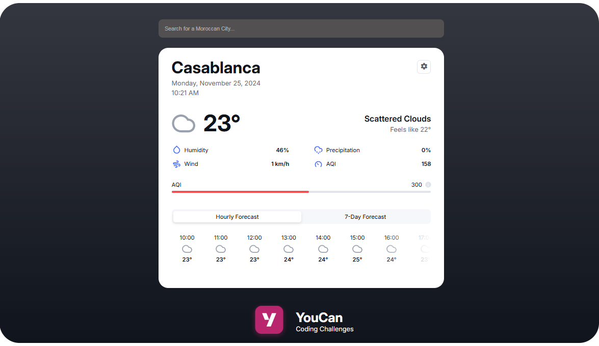

# YouCan Coding Challenge - Frontend


## Overview 

A weather app built with Vue.js, TypeScript, and Vanilla CSS. It uses the MapBox API to locate cities and places in Morocco, and the OpenWeather API to provide real-time weather data for those locations.

> [!NOTE]
> In the **Attachment** folder, you will find screenshots showcasing the demo of API testing, API documentation, and other relevant details.


## Technologies & Tools

- **Vue.js 3.5**: Frontend framework for building a dynamic and responsive UI.
- **TypeScript**: Adds type safety for better code quality.
- **Vanilla CSS**: Provides simple and efficient styling using pure CSS.
- **Axios**: Used for making HTTP requests to fetch data from APIs.
- **MapBox API**: Fetches city coordinates for accurate location mapping.
- **OpenWeather API**: Retrieves real-time weather data for cities in Morocco.
- **Postman**: Used to test and validate API endpoints.
- **Pinia**: State management solution for managing app data.


## Demo

Below is a screenshot of the app UI, based on the [Figma design](https://www.figma.com/design/PsxrPS1Wor2Xx6wHQjeP5q/Weather-App?node-id=56-353&t=71XLlLSK4i0QQ8Xu-1), with added search functionality.



Postman was used to test and validate the API endpoints, including the [OpenWeather API](https://openweathermap.org/api/one-call-3), [MapBox API](https://docs.mapbox.com/api/search/), and [Pollution API](https://openweathermap.org/api/air-pollution).


The [Air Quality Index (AQI)](https://openweathermap.org/air-pollution-index-levels) is calculated based on data from the Pollution APIs, using a standard formula to assess air quality levels.


## Usage

1. Clone the project using the command below:

   ```bash
   git clone https://github.com/akhatarmourad/Youcan-Frontend-Coding-Challenge.git
   ```

2. Open the project in your preferred code editor (e.g., VSCode, Sublime Text, Cursor, etc.).

3. Navigate to the weather-app folder

   ```bash
   cd weather-app
   ```

4. Install the required dependencies

    ````bash
    npm install
    ```
5. Before running the app, make sure to create a .env file in the root of the weather-app directory and add the necessary environment variables (API keys).

    ```bash
   VITE_MAPBOX_ACCESS_TOKEN=Your API Key Goes here...
   ```

   ```bash
   VITE_WEATHER_API_KEY=Your API Key Goes here...
   ```

6. To run the app in development mode, use the following command

   ```bash
   npm run dev
   ```

---

> [!IMPORTANT]
> If you encounter any issues or have feedback about the project, I would be grateful to hear from you. Your input is highly appreciated. Thank you!

